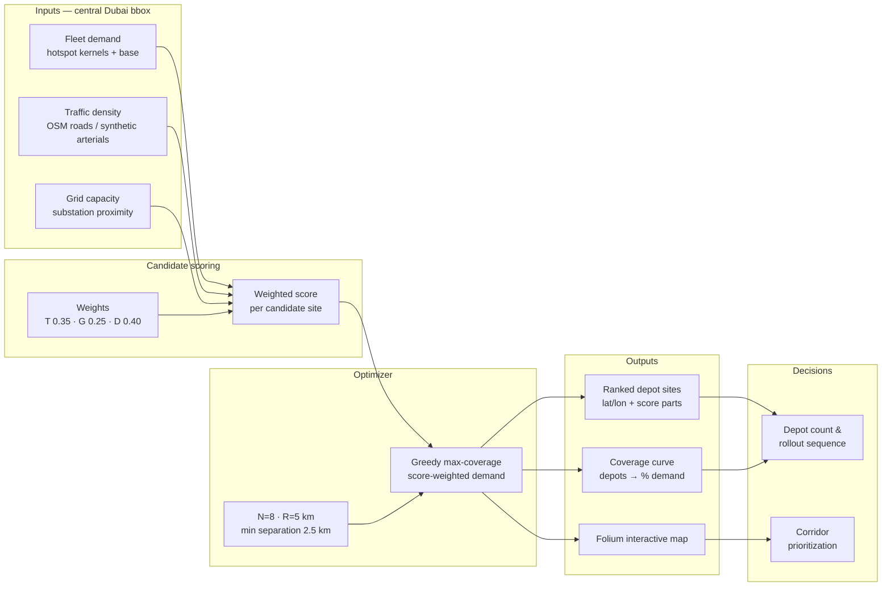
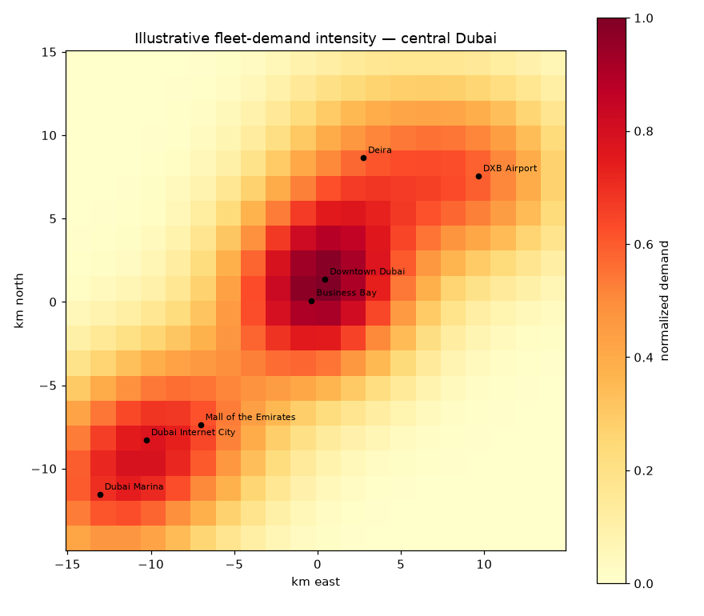
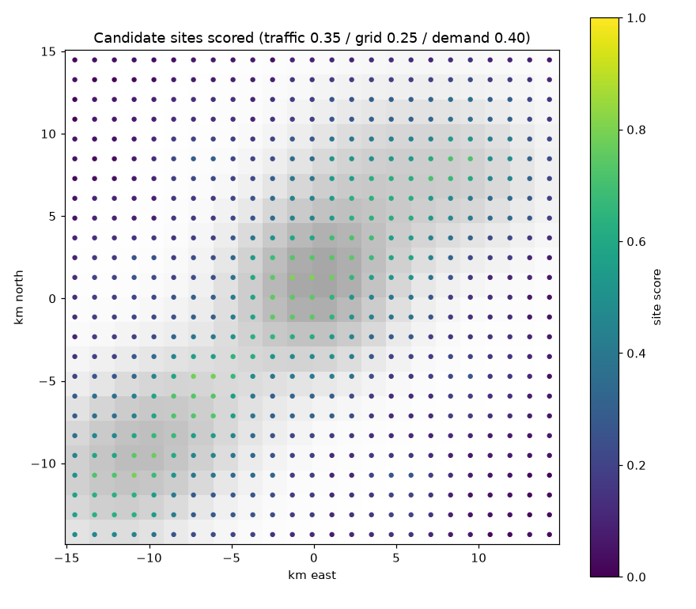
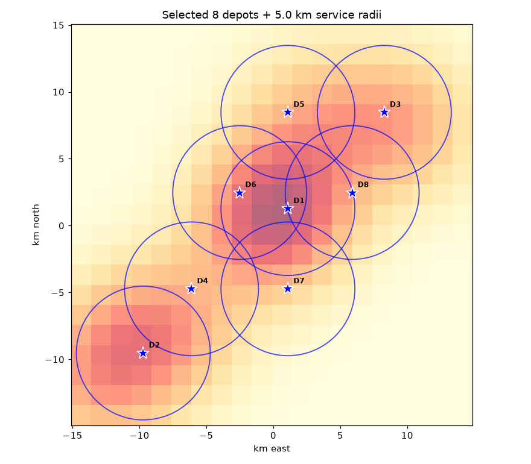
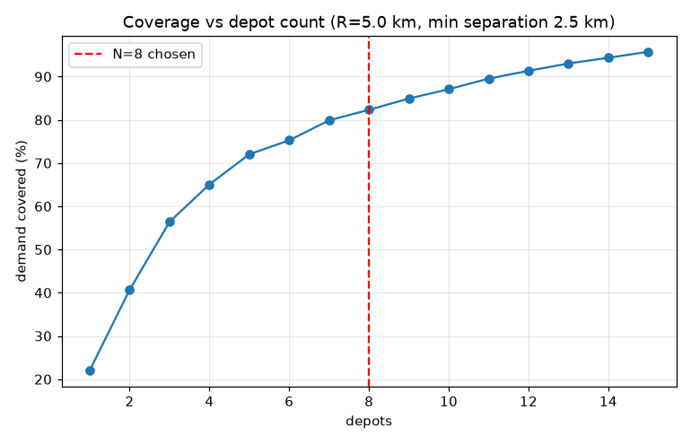

# EV Charging / AV Depot Site Selection — Dubai Case Study

A spatial multi-criteria model for siting **autonomous-vehicle depots / EV charging hubs**: candidate sites are scored on **traffic density**, **grid capacity**, and **fleet demand**, then a greedy optimizer picks depot locations that maximize score-weighted demand coverage.

> All numbers below are produced by the executed notebook in this repo from **illustrative modelling assumptions**, not measured market data. Road geometry was to come from OpenStreetMap (the Overpass download timed out, so documented synthetic arterials stand in); demand, traffic, and grid proxies are synthetic-but-documented. Calibrate with local data before any commercial use.

## Key Insights for Decision Makers

- **Situation:** AV fleet operators must commit depot and charging capex before demand is proven. **Complication:** In this Dubai case study, **8 depots at 5 km service radius cover 82% of illustrative demand — but the 9th depot adds only ~3 percentage points**, so over-building destroys the capex case. **Resolution:** Size the network on the coverage curve's knee, not on headline depot counts, and sequence later depots behind measured utilization.
- **Situation:** Site selection is usually argued from demand heatmaps. **Complication:** The chosen depot set is **most sensitive to the traffic-density criterion** — when traffic dominates the weights, only **14% of the selected sites survive** (vs 60% overlap when demand dominates) — yet traffic data is typically the weakest dataset in the room. **Resolution:** Spend the data budget on real corridor/traffic data first; demand hotspots alone pick a different, weaker network.
- **Situation:** Grid connection is treated as a downstream permitting detail. **Complication:** Depots score well only where **substation proximity coincides with demand corridors** — the winning zones cluster on the E11/E44 axis (Downtown Dubai, Dubai Internet City, DXB Airport) — so interconnection lead times can gate the entire rollout sequence. **Resolution:** Bring the utility to the site-selection table on day one and permit grid connections in parallel with depot construction, not after it.

## Live demo

[](https://share.streamlit.io)

No live deployment is hosted yet — deploy `app.py` yourself in one click on Streamlit Community Cloud:

1. Go to [share.streamlit.io](https://share.streamlit.io) and sign in with GitHub.
2. Click **New app** → select this repository (`HemanthMChakravarthy/ev-charging-av-depot-site-selection`).
3. Set the main file path to `app.py` → **Deploy**.

Local run: `pip install -r requirements.txt && streamlit run app.py`

The app offers sliders for the three criterion weights, depot count, and coverage radius — plus a ranked site table, coverage curve, and an interactive Folium map.

## Visuals

**Model architecture** — inputs → scoring → optimizer → outputs → decisions:



**Illustrative fleet-demand intensity (hotspots + distance decay):**



**Candidate sites scored (traffic 0.35 / grid 0.25 / demand 0.40):**



**Selected 8 depots with 5 km service radii:**



**Coverage vs depot count (diminishing returns):**



**Interactive map** (demand heatmap + depot markers): [assets/dubai_depot_map.html](assets/dubai_depot_map.html) — download and open in a browser.

## Methodology (summary)

1.5 km analysis grid over central Dubai (25.05–25.32 N, 55.12–55.42 E); 625 candidate sites on a 1.2 km lattice snapped to ≤400 m of a road.

| Component | Specification | Status |
|---|---|---|
| Fleet demand | Gaussian kernels (σ=4 km) around 7 illustrative hotspots + uniform base | Illustrative — not measured trips |
| Traffic density | Class-weighted road length per cell (motorway=3.0 … service=0.3); synthetic E11/E44 arterial traces after OSM timeout | Proxy — not loop-detector counts |
| Grid capacity | exp(−d/3 km) to nearest substation (12 synthetic points after OSM timeout) | Proxy — not feeder capacity |
| Scoring | Weighted linear: 0.35·traffic + 0.25·grid + 0.40·demand | Illustrative weights, adjustable |
| Optimizer | Greedy max-coverage on score-weighted demand; R=5 km, min separation 2.5 km | Heuristic |

Headline model outputs (from the executed notebook):

| Metric | Value |
|---|---|
| Demand covered by 8 depots @ R=5 km | 82.3% |
| Marginal gain of the 9th depot | +2.6 pp |
| Top-scoring candidate | 0.805 @ (25.197, 55.257) — Downtown Dubai |
| Winning zones | Downtown Dubai / Burj Khalifa, Dubai Internet City, DXB Airport |
| Most disruptive criterion (weight sensitivity) | Traffic density (14% depot-set overlap when dominant) |

Key model functions (`src/site_selection_model.py`): `make_grid()`, `demand_intensity()`, `traffic_from_edges()` / `synthetic_traffic()`, `grid_capacity()`, `candidate_points()`, `score_candidates()`, `greedy_max_coverage()`, `coverage_curve()`, `weight_sensitivity()`, `build_folium_map()`.

## Strategic & Commercial Implications for OEMs / Mobility Operators

(from the notebook's closing analysis, computed from model outputs)

1. **Capex discipline beats depot count** — 82% coverage at 8 depots with only ~3 pp from the 9th; size the network on the curve's knee.
2. **Site selection is a corridor play** — winners cluster on the E11/E44 axis, not a uniform grid; prioritize corridors over coverage uniformity.
3. **Buy traffic data before demand studies** — traffic-density is the most disruptive criterion (14% overlap); it deserves the best real data first.
4. **Grid interconnection is the quiet gate** — sequence utility permits with construction; a high-demand site without headroom is a stranded asset.
5. **Co-optimize with fleet economics** — depot capex per vehicle falls as utilization rises, so pair this model with the [fleet-TCO model](https://github.com/HemanthMChakravarthy/autonomous-fleet-tco-calculator): site selection and fleet sizing are one joint optimization.

## Repository structure

```
├── app.py                      # Streamlit interactive demo
├── src/site_selection_model.py # Importable model (grid, scoring, optimizer, maps)
├── notebooks/
│   └── ev_depot_site_selection.ipynb  # Fully executed analysis notebook
├── assets/                     # Charts + interactive Folium map (HTML)
├── data/                       # Cached OSM extracts or synthetic fallbacks + sources.json
├── tools/
│   ├── fetch_osm.py            # One-shot OSM downloader (network + substations)
│   └── build_notebook.py       # Notebook generator
├── requirements.txt
└── LICENSE                     # MIT
```

## Run it

```bash
pip install -r requirements.txt
# optional: fetch live OSM data (falls back to synthetic on failure)
python tools/fetch_osm.py
# notebook
jupyter nbconvert --to notebook --execute notebooks/ev_depot_site_selection.ipynb \
  --output /tmp/depot_out.ipynb
# or the interactive app
streamlit run app.py
```

## License

MIT — see [LICENSE](LICENSE). OSM data © OpenStreetMap contributors (where used).
